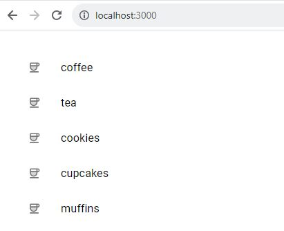
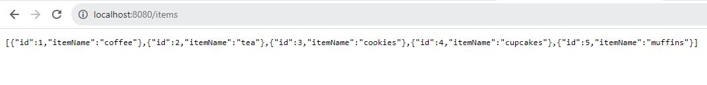

Start react application:

may need to delete `node_modules\.cache`

react-app% `npm run-script start`

Start springboot application:

springboot-app% `gradlew :bootRun`

Runs rest endpoint at http://localhost:8080/items

rebuilding with `gradlew build` will reload java changes

h2 console web app:

http://localhost:8080/h2-console (password = password)

Screenshots:

